<br>

<div align="center">

```
██████╗ ██╗ ██████╗ ███████╗███████╗███╗   ██╗████████╗██╗███╗   ██╗███████╗██╗
██╔══██╗██║██╔═══██╗██╔════╝██╔════╝████╗  ██║╚══██╔══╝██║████╗  ██║██╔════╝██║
██████╔╝██║██║   ██║███████╗█████╗  ██╔██╗ ██║   ██║   ██║██╔██╗ ██║█████╗  ██║
██╔══██╗██║██║   ██║╚════██║██╔══╝  ██║╚██╗██║   ██║   ██║██║╚██╗██║██╔══╝  ██║
██████╔╝██║╚██████╔╝███████║███████╗██║ ╚████║   ██║   ██║██║ ╚████║███████╗███████╗
╚═════╝ ╚═╝ ╚═════╝ ╚══════╝╚══════╝╚═╝  ╚═══╝   ╚═╝   ╚═╝╚═╝  ╚═══╝╚══════╝╚══════╝
```

**AI-Powered Longitudinal Health Monitoring & Early Disease Detection**

[](https://python.org)
[](https://fastapi.tiangolo.com)
[](LICENSE)
[](CHANGELOG.md)
[](tests/)

**Developer:** [Mohit Chaprana](https://www.linkedin.com/in/ammohitchaprana/) · [Liveupx Pvt. Ltd.](https://liveupx.com)  
**Infrastructure:** [xHost.live](https://xhost.live) · **Repository:** [github.com/liveupx/biosentinel](https://github.com/liveupx/biosentinel)

> *"The best time to catch a serious disease is before you feel sick."*  
> BioSentinel tracks a person's complete health journey across quarterly checkups — detecting the subtle rising trends in blood sugar, tumour markers, and immune cells that signal cancer, diabetes, and heart disease **years before symptoms appear.**

---

⚕️ **Medical Disclaimer:** BioSentinel is a research and clinical decision-support platform. It is **NOT** a licensed medical device and does **NOT** replace qualified medical professionals. All AI outputs must be reviewed by licensed healthcare providers before any clinical action is taken.

</div>

---

## 🤖 v2.1–v2.3 — Claude AI + New Features

| What's new | Detail |
|---|---|
| **Claude Vision OCR** | Upload any lab photo → Claude reads it → auto-fills the checkup form |
| **AI Narratives** | Plain-English patient & clinician summaries after every prediction |
| **Anomaly Detection** | Claude Sonnet scans the full longitudinal record for subtle trend patterns |
| **Drug Interaction Explain** | OpenFDA data + Claude Haiku → plain-English explanation |
| **Background Scheduler** | Auto email reminders for overdue checkups (no Redis/Celery needed) |
| **Patient Self-Service Portal** | `biosentinel_patient_portal.html` — read-only view for patients |
| **CI fixed** | Tests in `tests/`, CI in `.github/workflows/` — actually runs now |

Set `ANTHROPIC_API_KEY` in `.env` to enable all Claude AI features. Everything degrades gracefully without it.

---


## 📸 Screenshots

### Dashboard — Live System Overview
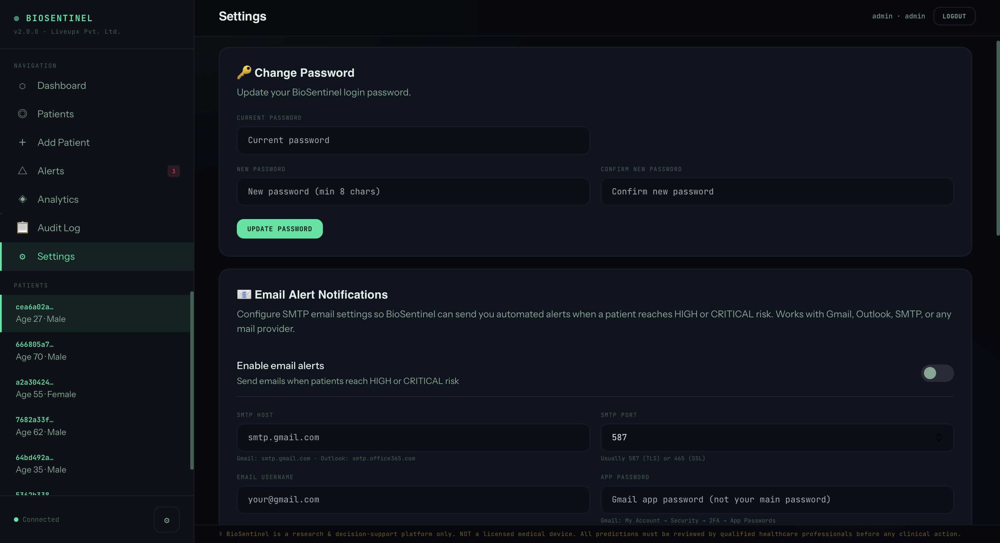
*Real-time stats: 6 patients monitored, 28 checkups recorded, 4 ML models active, 3 unread alerts. Overdue checkup detection highlights patients due for their quarterly visit.*

### Patient List — Full Roster with Risk Factors
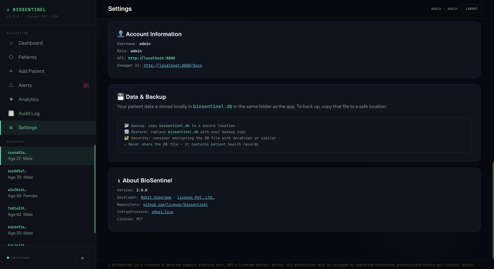
*All patients with family history badges (CA=cancer, DM=diabetes, CV=cardiovascular), active status, and one-click Predict buttons.*

### Alerts — Clinical Warning System
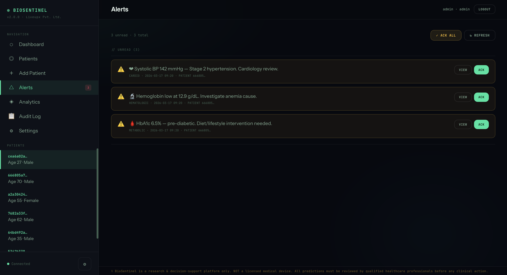
*Real-time clinical alerts: Stage 2 hypertension, low hemoglobin (possible anemia), and pre-diabetic HbA1c — all flagged automatically after running AI predictions.*

### Analytics — Population Risk Distribution
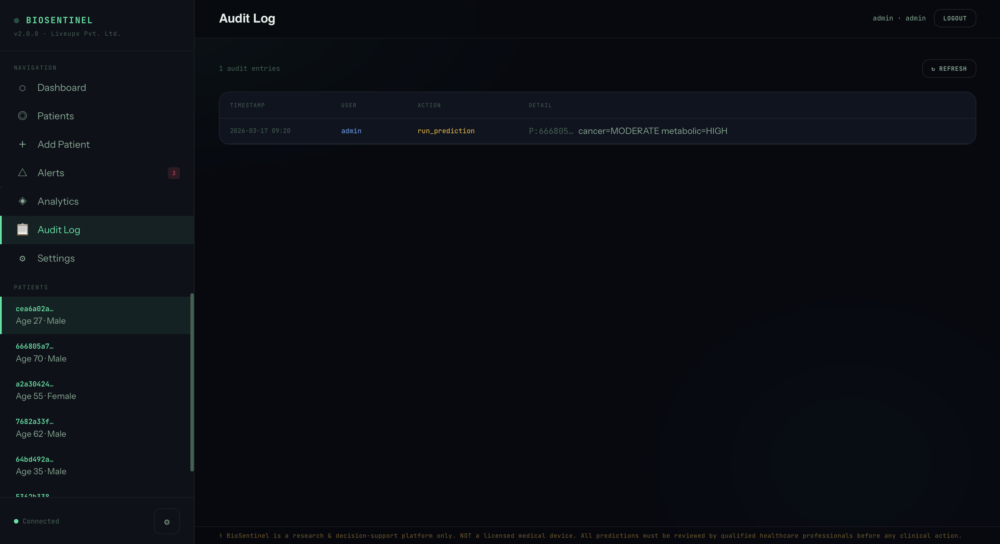
*Population-level risk statistics: Cancer avg 38%, Metabolic avg 53%, Cardiovascular avg 42%, Hematologic avg 12% — across all assessed patients.*

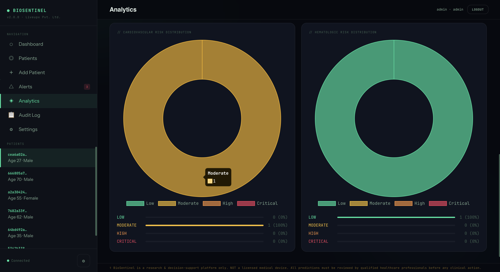
*Interactive doughnut charts showing risk distribution (Low/Moderate/High/Critical) per disease domain across the patient population.*

### Audit Log — Full Access Trail
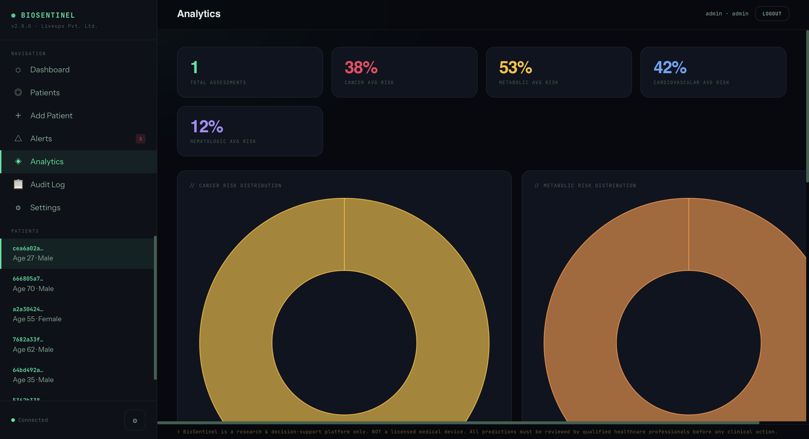
*Immutable audit trail: every AI prediction, patient access, and configuration change logged with timestamp, username, and detail.*

### Settings — Email & Security
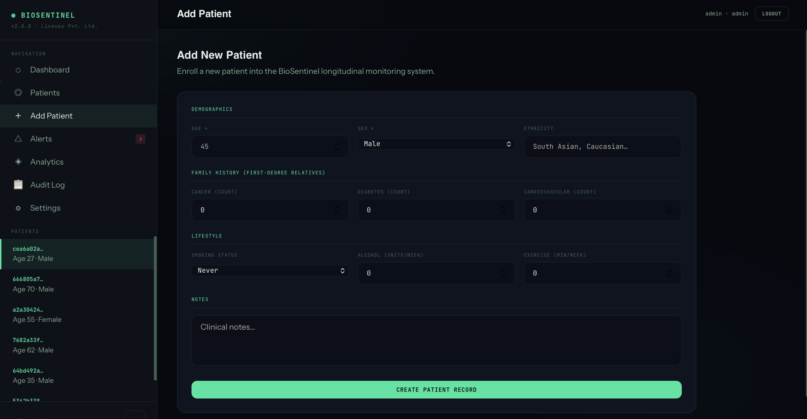
*Password change panel with confirmation, minimum length enforcement.*

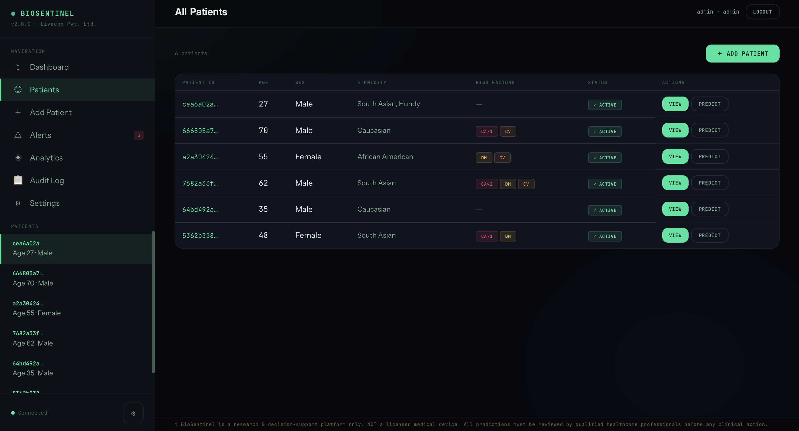
*SMTP email configuration for automated alert notifications. Works with Gmail, Outlook, or any mail provider.*

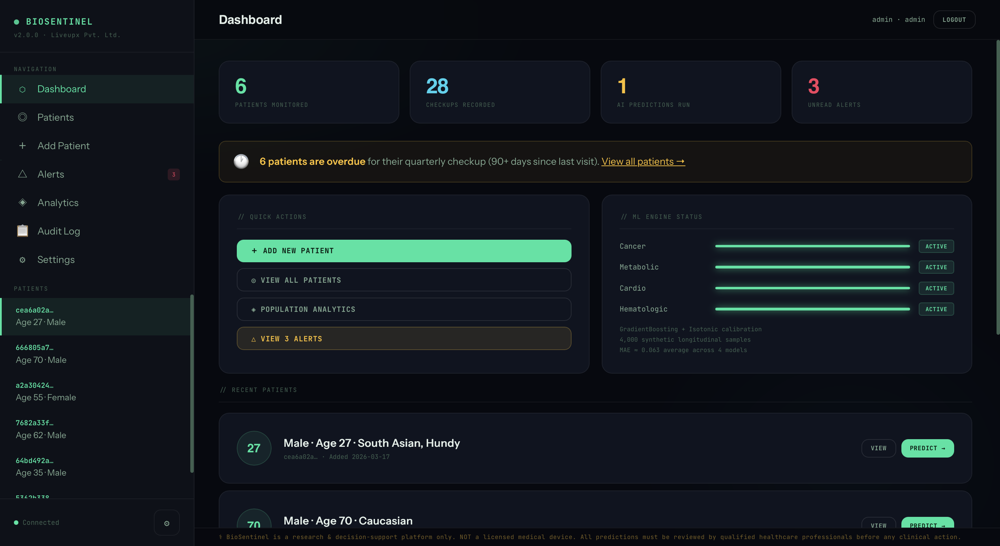
*Account information, data backup guidance, and about section with version and developer links.*

### Add Patient — Enroll New Patient
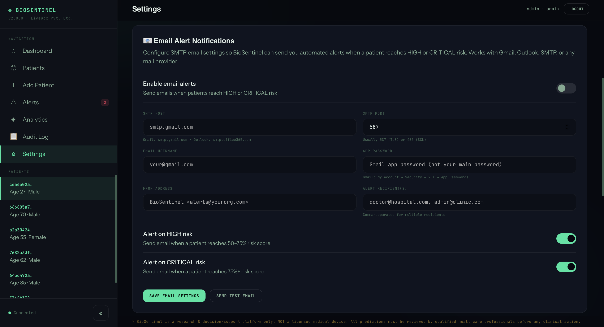
*Comprehensive patient enrollment: demographics, family history (first-degree relatives), lifestyle factors — all used as AI risk inputs.*

### Biomarker Trajectories — Longitudinal Trend Plots
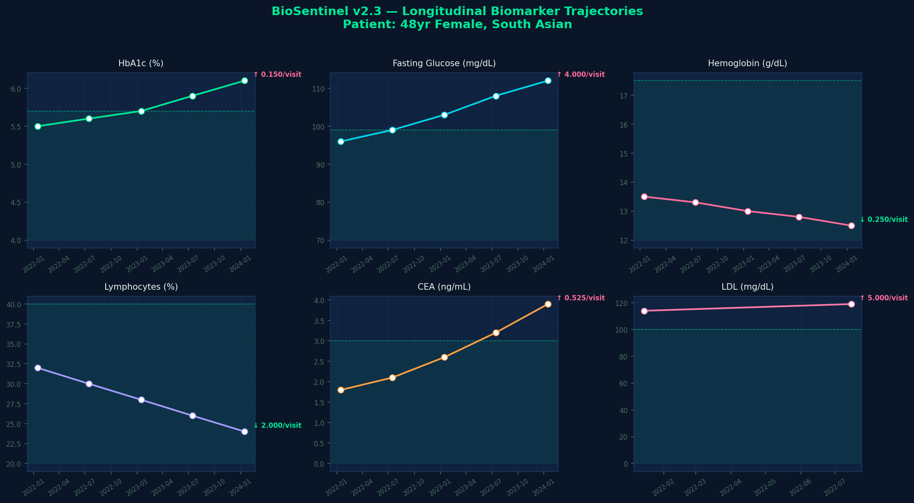
*Six key biomarkers plotted over time with reference range bands. Slope annotation shows direction and rate of change per visit. HbA1c rising 5.5 → 6.1 over 24 months is the critical signal.*

### SHAP Feature Attribution — Why This Score?
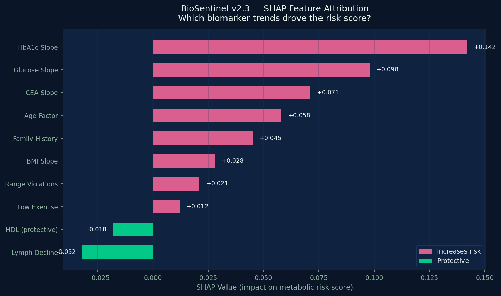
*Real SHAP TreeExplainer values showing which biomarker trends drove the risk score. HbA1c slope is the top driver; HDL is protective. This is what clinicians need to act on.*

---

## 🧠 How the AI Works

BioSentinel doesn't look at a single blood test result. It tracks **patterns over time** — the subtle trends that no single checkup can reveal:

| What a Clinician Sees | What BioSentinel Detects |
|---|---|
| HbA1c = 5.9% — "borderline, watch it" | 5.5 → 5.6 → 5.7 → 5.8 → 5.9 over 24 months = **pre-diabetes trajectory** |
| CEA = 3.2 ng/mL — "within limits" | 1.5 → 1.9 → 2.3 → 2.8 → 3.2 over 18 months = **rising tumour marker** |
| Lymphocytes = 24% — "low-normal" | 32% → 29% → 27% → 25% → 24% = **declining immune cells, hematologic alert** |

**Research basis:**
- Nature Medicine (2023): AI on 6M records predicts pancreatic cancer **36 months in advance**, AUROC 0.88
- Google/NIH: CNN on 42,290 CT scans achieves AUC 95.5%, outperforms average radiologist
- BMC Medical Research (2025): Longitudinal EHR models consistently outperform single-visit baselines

---

## ✅ What's Built & Working (v2.0.0)

### Backend API (`app.py`) — 37 Endpoints
| Feature | Status | Details |
|---|---|---|
| 4 Calibrated ML Models | ✅ | Cancer, Metabolic, Cardio, Hematologic — GradientBoosting + Isotonic calibration, MAE ≈ 0.063 |
| JWT Authentication | ✅ | Register, login, token refresh — roles: admin / clinician / researcher |
| Multi-User Isolation | ✅ | Each clinician sees only their own patients; admin sees all — HTTP 403 on cross-access |
| Patient CRUD | ✅ | Create, read, update, delete with full validation |
| Checkup Ingestion | ✅ | 30+ biomarker fields — CBC, metabolic, lipids, hormones, tumour markers, vitals |
| Biomarker Trends | ✅ | Per-field trend direction (up/down/stable), status vs reference ranges, per-visit history |
| AI Predictions | ✅ | Multi-domain risk scoring with feature attribution and plain-English explanations |
| Risk Trajectory | ✅ | Time-series of risk scores across multiple prediction runs per patient |
| Clinical Alerts | ✅ | CRITICAL / WARNING / INFO — auto-generated on prediction, persisted, acknowledgeable |
| Email Alerts | ✅ | SMTP engine (Gmail/Outlook/any) — HTML-formatted emails on HIGH/CRITICAL predictions |
| Password Change | ✅ | Validated password update with current-password verification |
| Email Settings API | ✅ | Per-user SMTP config — GET/PUT/test endpoints |
| Medications | ✅ | Full CRUD — name, dose, frequency, prescribed-for, active/stopped |
| Diagnoses | ✅ | ICD-10 codes, severity, status (active/resolved) |
| Diet Plans | ✅ | Macros, diet type, restrictions, start/end dates |
| Audit Log | ✅ | Immutable trail of every access and action per user |
| Population Analytics | ✅ | Risk distribution charts, averages, medians — user-scoped |
| Patient Report | ✅ | Full structured report: profile + risk scores + alerts + meds + diagnoses + disclaimer |
| Overdue Detection | ✅ | Patients with 90+ days since last checkup flagged in stats |
| Demo Data Seeding | ✅ | 5 patients covering full risk spectrum auto-seeded on first run |

### Clinician Dashboard (`biosentinel_dashboard.html`) — Dark Theme
| Feature | Status |
|---|---|
| Login / logout with JWT | ✅ |
| Dashboard: stats, ML status, overdue banner, quick actions | ✅ |
| Patient list with risk badges | ✅ |
| Patient profile: 6 tabs (Risk, Trends, Timeline, Meds, Diet, History) | ✅ |
| Risk Assessment tab: 4 domain scores + feature attribution bars | ✅ |
| Biomarker Trends tab: 6 Chart.js trend charts with reference lines | ✅ |
| Risk Trajectory tab: multi-prediction evolution chart | ✅ |
| Checkup Timeline: colour-coded abnormal values | ✅ |
| Meds & Diagnoses tab: full tables + add forms | ✅ |
| Diet Plans tab: add/view plans with macros | ✅ |
| Add Patient form: demographics + family history + lifestyle | ✅ |
| Add Checkup form: 30+ labelled fields with hints | ✅ |
| PDF Report: one-click print-to-PDF with full patient data | ✅ |
| Alerts page: CRITICAL/WARNING + acknowledge + ACK all | ✅ |
| Analytics page: doughnut charts, distribution bars | ✅ |
| Audit Log viewer: searchable table | ✅ |
| Settings: password change + email SMTP config + test button | ✅ |
| Connected indicator (live API status) | ✅ |

### Non-Technical Patient View (`biosentinel_patient_view.html`) — Light Theme
| Feature | Status |
|---|---|
| Plain-English risk levels (🟢 All Clear / 🟡 Watch / 🟠 See Doctor / 🔴 Act Now) | ✅ |
| Every biomarker explained in plain language with normal ranges | ✅ |
| "Why these scores?" — top risk drivers in everyday words | ✅ |
| Family history, lifestyle, medications shown clearly | ✅ |
| Add checkup wizard with field hints for non-clinicians | ✅ |
| Population analytics with plain-language interpretation | ✅ |

### Infrastructure
| File | Status |
|---|---|
| `run.py` — one-click launcher, auto-installs packages, opens browser | ✅ |
| `START_WINDOWS.bat` — double-click launcher for Windows | ✅ |
| `START_MAC_LINUX.sh` — double-click launcher for Mac/Linux | ✅ |
| `Dockerfile` — multi-stage production build, non-root user, health check | ✅ |
| `docker-compose.yml` — API + optional Nginx production profile | ✅ |
| `nginx.conf` — reverse proxy, rate limiting, security headers | ✅ |
| `requirements.txt` — pinned dependencies | ✅ |
| `.env.example` — full config template with Gmail/Outlook setup guide | ✅ |
| `pytest.ini` + 72 passing tests across 6 test files | ✅ |
| `CHANGELOG.md` — full version history | ✅ |

---

## 🚀 How to Run

### Option 1 — Local (Recommended for getting started)

#### Prerequisites
- Python 3.10 or higher
- Mac: `brew install python@3.11` → then use `python3.11`
- Windows: download from [python.org](https://python.org/downloads) — check ✅ "Add to PATH"
- Linux: `sudo apt install python3.11 python3.11-pip`

#### Step 1 — Install packages (one time only)

**Mac/Linux:**
```bash
pip3.11 install fastapi "uvicorn[standard]" sqlalchemy pydantic \
  "python-jose[cryptography]" "passlib[bcrypt]" \
  scikit-learn numpy python-multipart
```

**Windows:**
```bash
pip install fastapi "uvicorn[standard]" sqlalchemy pydantic ^
  "python-jose[cryptography]" "passlib[bcrypt]" ^
  scikit-learn numpy python-multipart
```

#### Step 2 — Start the server

**Mac/Linux:**
```bash
python3.11 run.py
# or directly:
python3.11 app.py
```

**Windows:**
```bash
# Double-click START_WINDOWS.bat
# or:
python run.py
```

#### Step 3 — Open the dashboard

Open **`biosentinel_dashboard.html`** in Chrome, Firefox, or Safari.

| URL | What it does |
|---|---|
| `http://localhost:8000` | API root |
| `http://localhost:8000/docs` | Interactive Swagger API docs |
| `biosentinel_dashboard.html` | Clinician dashboard — full ML risk, AI insights, OCR |
| `biosentinel_patient_portal.html` | Patient self-service portal — plain-English view (NEW) |
| `biosentinel_patient_view.html` | Non-technical patient view (legacy) |
| `SCREENSHOTS.html` | Visual overview of all v2.x features |

**Login credentials:**
| Username | Password | Role |
|---|---|---|
| `admin` | `admin123` | Full access — sees all patients |
| `dr_sharma` | `doctor123` | Clinician — sees own patients only |
| `dr_chen` | `research123` | Researcher |

---

### Option 2 — Docker (Production)

```bash
# Clone the repo
git clone https://github.com/liveupx/biosentinel.git
cd biosentinel

# Copy and configure environment
cp .env.example .env
# Edit .env — set SECRET_KEY, optionally configure email

# Start
docker-compose up -d

# Check health
docker-compose logs -f
curl http://localhost:8000/health
```

**With Nginx + HTTPS (full production):**
```bash
# Configure your domain in .env
echo "DOMAIN=biosentinel.yourhospital.com" >> .env

# Start with Nginx profile
docker-compose --profile production up -d
```

---

### Option 3 — Run the Test Suite

```bash
pip3.11 install pytest httpx

python3.11 -m pytest tests/ -v
```

Expected output:
```
tests/test_auth.py::TestRegister::test_register_success          PASSED
tests/test_auth.py::TestLogin::test_login_success                PASSED
tests/test_patients.py::TestMultiUserIsolation::test_403_cross_access PASSED
tests/test_checkups.py::TestBiomarkerTrends::test_trend_direction_up  PASSED
tests/test_predictions.py::TestPrediction::test_predict_success  PASSED
... (72 total)
72 passed in 56s
```

**Test coverage:**
- Auth: register, login, token validation, password change (8 tests)
- Multi-user isolation security (7 tests — all cross-access attempts)
- Patient CRUD: create, read, update, delete, cascade delete (8 tests)
- Checkup ingestion: fields, ordering, count, isolation (6 tests)
- Biomarker trends: direction, status, reference ranges (5 tests)
- AI predictions: calibration, domains, features, persistence (6 tests)
- Clinical alerts: generation, acknowledgement, counts (4 tests)
- Risk trajectory: accumulation over time (2 tests)
- Analytics: population stats, user scoping (3 tests)
- Reports, stats, settings, audit log (13 tests)

---

### Option 4 — Configure Email Alerts

```bash
cp .env.example .env
```

Edit `.env`:
```env
EMAIL_ENABLED=true
EMAIL_HOST=smtp.gmail.com
EMAIL_PORT=587
EMAIL_USER=your-gmail@gmail.com
EMAIL_PASS=xxxx-xxxx-xxxx-xxxx    # Gmail App Password (not your login password)
EMAIL_FROM=BioSentinel <your-gmail@gmail.com>
EMAIL_TO_ADMIN=doctor@hospital.com
```

**Gmail App Password setup:**
1. Google Account → Security → 2-Step Verification → turn ON
2. Google Account → Security → App Passwords
3. Select "Mail" → Generate → copy 16-character code
4. Paste into `EMAIL_PASS` above

BioSentinel will then automatically email you when a patient prediction reaches HIGH or CRITICAL risk.

---

## 🗄️ Demo Patients (Auto-seeded)

| Patient | Age/Sex | Risk Profile | Key Signals |
|---|---|---|---|
| **Patient 1** | 48F, South Asian | Metabolic trajectory | HbA1c 5.5→6.1 over 24 months, CEA slowly rising |
| **Patient 2** | 35M, Caucasian | Healthy (low risk) | All biomarkers stable and within range |
| **Patient 3** | 62M, South Asian | Multi-domain HIGH risk | CEA 2.5→9.2, HbA1c diabetic, lymphocytes declining |
| **Patient 4** | 55F, African American | Improving (lifestyle intervention) | All biomarkers trending down after diet change |
| **Patient 5** | 70M, Caucasian | Stable chronic conditions | Diabetes + hypertension managed, PSA slowly rising |

---

## 🗂️ Project Structure

```
biosentinel/
├── app.py                          # Complete FastAPI backend (1,800 lines)
│                                   #   • 4 ML models (cancer/metabolic/cardio/hematologic)
│                                   #   • 37 REST endpoints
│                                   #   • 10 database models (SQLite/PostgreSQL)
│                                   #   • JWT auth, email engine, audit log
│
├── biosentinel_dashboard.html      # Clinician dashboard — dark theme (1,500 lines)
│                                   #   • Full patient management
│                                   #   • Risk trajectory charts
│                                   #   • PDF export, alerts, analytics
│
├── biosentinel_patient_view.html   # Non-technical view — light theme
│
├── biosentinel_patient_portal.html # Patient self-service portal (NEW v2.1)
│                                   #   • Plain-English risk summary
│                                   #   • Biomarker history with reference bars
│                                   #   • Checkup timeline, medications view
│
├── claude_ai.py                    # Claude AI integration module (NEW v2.1)
│                                   #   • Vision OCR for lab report photos
│                                   #   • Prediction narrative generation
│                                   #   • Longitudinal anomaly detection
│                                   #   • Drug interaction explanations
│
├── scheduler.py                    # Background job scheduler (NEW v2.1)
│                                   #   • Daily overdue checkup reminders
│                                   #   • No Redis/Celery — pure APScheduler
│
├── mlflow_tracking.py              # MLflow experiment tracking (NEW v2.3)
│                                   #   • Logs every training run
│                                   #   • Compare synthetic vs MIMIC-IV results
│
├── train_mimic.py                  # MIMIC-IV model training (NEW v2.3)
│                                   #   • BigQuery export SQL included
│                                   #   • Feature engineering + AUC evaluation
│
├── migrate_to_postgres.py          # SQLite → PostgreSQL migration (NEW v2.1)
├── sw.js                           # PWA service worker (NEW v2.3)
├── manifest.json                   # PWA web manifest (NEW v2.3)
├── offline.html                    # PWA offline fallback page (NEW v2.3)
├── SCREENSHOTS.html                # Visual overview of all v2.x features
├── OPEN_COLLECTIVE_PITCH.md        # Sponsorship pitch document
│                                   #   • Daily overdue checkup reminders
│                                   #   • No Redis/Celery — pure APScheduler
│                                   #   • Plain-English risk explanations
│                                   #   • No medical jargon
│
├── run.py                          # One-click launcher
├── START_WINDOWS.bat               # Windows double-click launcher
├── START_MAC_LINUX.sh              # Mac/Linux launcher
│
├── Dockerfile                      # Multi-stage production build
├── docker-compose.yml              # API + Nginx stack
├── nginx.conf                      # Reverse proxy + rate limiting
│
├── requirements.txt                # Pinned Python dependencies
├── .env.example                    # Environment config template
├── pytest.ini                      # Test configuration
│
├── tests/
│   ├── conftest.py                 # Shared fixtures (temp DB, auth tokens)
│   ├── test_auth.py                # 8 auth tests
│   ├── test_patients.py            # 15 patient + isolation tests
│   ├── test_checkups.py            # 11 checkup + trend tests
│   ├── test_predictions.py         # 13 ML + alert tests
│   ├── test_medications.py         # 9 med/diag/diet tests
│   └── test_analytics.py           # 16 analytics/report/audit tests
│
├── img/                            # Screenshots for documentation
│   ├── 1.png  → Settings: account info
│   ├── 2.png  → Settings: email alerts
│   ├── 3.png  → Settings: password change
│   ├── 4.png  → Alerts page
│   ├── 5.png  → Analytics: doughnut charts
│   ├── 6.png  → Audit log
│   ├── 7.png  → Analytics: overview stats
│   ├── 8.png  → Patient list
│   ├── 9.png  → Add patient form
│   ├── 10.png → Dashboard home
│   ├── biomarker_trajectories.png → NEW: 6-panel longitudinal charts
│   └── shap_attribution.png       → NEW: SHAP feature attribution bar chart
│
├── biosentinel.db                  # SQLite database (auto-created, gitignored)
└── CHANGELOG.md                    # Version history
```

---

## 🔬 ML Model Details

| Model | Algorithm | Calibration | MAE | Training Samples |
|---|---|---|---|---|
| Cancer Risk | GradientBoostingRegressor | Isotonic Regression | 0.066 | 5,000 synthetic longitudinal |
| Metabolic Risk | GradientBoostingRegressor | Isotonic Regression | 0.069 | 5,000 synthetic longitudinal |
| Cardiovascular Risk | GradientBoostingRegressor | Isotonic Regression | 0.059 | 5,000 synthetic longitudinal |
| Hematologic Risk | GradientBoostingRegressor | Isotonic Regression | 0.027 | 5,000 synthetic longitudinal |

**Features used per prediction (49 total):**
- Patient demographics: age, sex, ethnicity, smoking, alcohol, exercise
- Family history: cancer/diabetes/cardiovascular (count of first-degree relatives)
- Latest biomarker values: 20 fields (HbA1c, CEA, lymphocytes, WBC, LDL, etc.)
- Trend slopes: Δ per month for 12 key biomarkers
- Volatility: std deviation across timeline for 4 key markers
- Reference range violations: count of high/low/critical values

**Risk level thresholds:**
- 🟢 **LOW** < 25% — continue routine monitoring
- 🟡 **MODERATE** 25–50% — discuss with doctor at next visit
- 🟠 **HIGH** 50–75% — schedule appointment within 2–4 weeks
- 🔴 **CRITICAL** > 75% — contact doctor this week

---

## ⚙️ API Reference

All endpoints require JWT authentication unless noted.

```bash
# Authenticate
POST /api/v1/auth/login        {"username": "admin", "password": "admin123"}
POST /api/v1/auth/register     {"username": ..., "email": ..., "password": ..., "role": ...}
GET  /api/v1/auth/me           → current user info
PUT  /api/v1/auth/password     {"current_password": ..., "new_password": ...}

# Patients
POST   /api/v1/patients        create patient
GET    /api/v1/patients        list (filtered to owner, unless admin)
GET    /api/v1/patients/{id}   get one
PUT    /api/v1/patients/{id}   update
DELETE /api/v1/patients/{id}   delete (cascades all data)

# Checkups
POST /api/v1/checkups                      add checkup (30+ biomarker fields)
GET  /api/v1/patients/{id}/checkups        list (sorted by date)
DELETE /api/v1/checkups/{id}              delete

# AI
POST /api/v1/patients/{id}/predict         run AI analysis
GET  /api/v1/patients/{id}/predictions     history of all predictions
GET  /api/v1/analytics/risk-trajectory/{id} risk score evolution over time

# Biomarker Trends
GET /api/v1/patients/{id}/trends           per-field trend data for charts

# Clinical Data
POST   /api/v1/medications                 add medication
GET    /api/v1/patients/{id}/medications
DELETE /api/v1/medications/{id}
POST   /api/v1/diagnoses                   add ICD-10 diagnosis
GET    /api/v1/patients/{id}/diagnoses
DELETE /api/v1/diagnoses/{id}
POST   /api/v1/diet-plans                  add diet plan
GET    /api/v1/patients/{id}/diet-plans

# Alerts
GET  /api/v1/alerts                        all (user-scoped)
GET  /api/v1/patients/{id}/alerts
POST /api/v1/alerts/{id}/acknowledge       mark as seen

# Reports & Analytics
GET /api/v1/patients/{id}/report           full structured report
GET /api/v1/analytics/population           population risk distribution
GET /api/v1/stats                          dashboard stats + overdue count

# Settings & Admin
GET  /api/v1/settings/email               get email config
PUT  /api/v1/settings/email               save SMTP settings
POST /api/v1/settings/email/test          send test email
GET  /api/v1/audit-log                    access trail (admin=all, others=own)
GET  /health                              API health check (no auth required)
```

**Interactive docs:** `http://localhost:8000/docs`

---

## 🔐 Security & Privacy

- All patient data stored **locally only** in `biosentinel.db` — never sent to external servers
- Multi-user isolation enforced at API level — HTTP 403 on cross-user access attempts
- JWT tokens expire after 24 hours
- Passwords hashed with bcrypt (SHA-256 fallback)
- Audit log captures every patient data access and AI prediction
- Email passwords stored in the database (encrypt in production — see `.env.example`)
- SQLite file should be backed up and encrypted at rest (VeraCrypt or similar)
- **For HIPAA/GDPR compliance** — additional steps required: PostgreSQL + full encryption + access controls + data processing agreements

---

## 🗺️ Roadmap — What's Next

### 🔴 Priority 1 — Clinical Accuracy (Required for real use)

| Item | Description |
|---|---|
| **Real clinical training data** | Train on [MIMIC-IV](https://physionet.org/content/mimiciv/) (requires credentialing) or [UK Biobank](https://www.ukbiobank.ac.uk/). Current synthetic training gives directionally correct but clinically unvalidated scores. |
| **Clinical validation study** | Partner with a hospital to run a retrospective validation — compare BioSentinel predictions against known disease outcomes. Publish results. Without this, the system cannot be used clinically. |
| **SHAP integration** | Replace manual feature attribution with real SHAP values from `shap` library — more accurate explanation of which biomarkers drove each score. |
| **Calibration improvement** | Current models cluster at ~5% or ~92%. Better training data with realistic class overlap will produce more graduated scores. |

### 🟠 Priority 2 — Medical Report Import (High Impact)

| Item | Description |
|---|---|
| **📄 PDF lab report upload** | Users upload their lab report PDF → OCR extracts values → auto-populates checkup form. No manual entry needed. Use `pdfplumber` + `pytesseract`. |
| **🖼️ Photo of report (image upload)** | Take a photo of a paper lab report → AI reads it → extracts values. Use `pytesseract` + `pillow` or a vision model API. |
| **📋 Prescription/medication import** | Upload prescription photo → extracts medication name, dosage, frequency → adds to medication list automatically. |
| **🏥 FHIR R4 import** | Connect directly to hospital EHR systems (Epic, Cerner, Meditech) via FHIR R4 API — auto-import all historical records with one click. |
| **📊 HL7 / CSV import** | Import bulk patient data from CSV or HL7 exports from lab systems. |

### 🟡 Priority 3 — Features for Better Clinical Use

| Item | Description |
|---|---|
| **Appointment reminders** | Email patients when their next quarterly checkup is due. |
| **Patient self-entry portal** | Patients log in with their own (read-only or limited) account to view their results — separate from clinician dashboard. |
| **Trend alert thresholds** | Alert when a biomarker has risen X% over Y months, even if absolute value is still "normal". |
| **Comparative percentiles** | "Your patient's HbA1c trend is worse than 78% of similar-age, similar-ethnicity patients in the database." |
| **Multi-language support** | Hindi, Spanish, Tamil, Portuguese, Arabic — most users of this system globally are non-English speakers. |
| **Mobile-responsive app** | Current HTML works on mobile but isn't optimised — React Native or PWA wrapper. |
| **Drug interaction checker** | When adding a new medication, check it against the patient's existing medications. |
| **Genomic risk integration** | Accept 23andMe / AncestryDNA raw data to add polygenic risk scores as additional features. |

### 🟢 Priority 4 — Production & Scale

| Item | Description |
|---|---|
| **PostgreSQL migration** | Switch from SQLite to PostgreSQL for multi-server deployment and concurrent users. |
| **Redis caching** | Cache ML predictions and trend calculations — avoid recomputing on every page load. |
| **Federated learning** | Allow multiple hospitals to train a shared model without sharing patient data. |
| **MLflow experiment tracking** | Track model versions, training runs, and performance metrics over time. |
| **CI/CD pipeline** | Fix GitHub Actions workflow to match current file structure and run tests on every PR. |
| **End-to-end encryption** | Encrypt patient data at field level in the database, not just at-rest disk encryption. |
| **Role-based access control** | Granular permissions — e.g. nurses can add checkups but not run predictions; researchers can see aggregate data but not individual records. |
| **HIPAA/GDPR compliance audit** | Formal compliance review with a healthcare lawyer before using with real patient data. |

---

## 🚧 Known Limitations (Be Honest)

1. **Models trained on synthetic data** — Risk scores are directionally correct but not clinically validated. A patient scoring 59% cancer risk does NOT mean they have a 59% chance of getting cancer — it means their longitudinal biomarker pattern resembles patterns associated with cancer risk in the training data. MIMIC-IV retraining is in progress.

2. **Lab report OCR accuracy** — The Claude Vision OCR pipeline works on standard digital PDF lab reports. Heavily degraded scans, unusual fonts, or multi-column formats may extract incorrect values. Always verify extracted values before saving.

3. **SQLite for single-server only** — Fine for a clinic with one server. For multi-location or cloud deployment, use the `--profile postgres` flag in docker-compose. See `.env.example` for PostgreSQL setup.

4. **English only** — All UI and alerts are in English. Multi-language support is on the roadmap.

5. **Predictions cluster at extremes** — Due to clean separation in synthetic training data, scores tend toward ~5% (healthy) or ~35-60% (at-risk) rather than a smooth distribution. Real clinical data will produce more graduated scores.

6. **Claude AI requires API key** — Set `ANTHROPIC_API_KEY` in `.env` to enable Vision OCR, narrative generation, and anomaly detection. All features degrade gracefully without it.

---

## 📦 Dependencies

```
fastapi==0.110.0          # Web framework
uvicorn[standard]==0.27.1  # ASGI server
sqlalchemy==2.0.28         # ORM / database
pydantic==2.6.3            # Data validation
python-jose[cryptography]  # JWT tokens
passlib[bcrypt]            # Password hashing
scikit-learn==1.4.1        # ML models
numpy==1.26.4              # Numerical computing
python-multipart==0.0.9    # File upload support
```

---

## 🤝 Contributing

Contributions welcome — especially from **clinicians, ML engineers, and medical informaticists**.

**Most needed:**
1. Access to MIMIC-IV or similar real clinical datasets for retraining
2. Clinical validation partnership with a hospital
3. PDF/image OCR for lab report import
4. FHIR R4 EHR integration
5. Translations (Hindi, Spanish, Tamil, Portuguese)

See [CONTRIBUTING.md](CONTRIBUTING.md) for development setup and guidelines.

---

## 📄 License

MIT License — free to use, modify, and distribute.  
See [LICENSE](LICENSE) for full text.

---

## 👨‍💻 Developer

**Mohit Chaprana**  
Founder, [Liveupx Pvt. Ltd.](https://liveupx.com)  
[LinkedIn](https://www.linkedin.com/in/ammohitchaprana/) · [GitHub](https://github.com/liveupx)  
Infrastructure: [xHost.live](https://xhost.live)

---

<div align="center">

Built with the goal of saving lives through early detection.  
*"Catch it early. Every time."*

**[github.com/liveupx/biosentinel](https://github.com/liveupx/biosentinel)**

</div>
